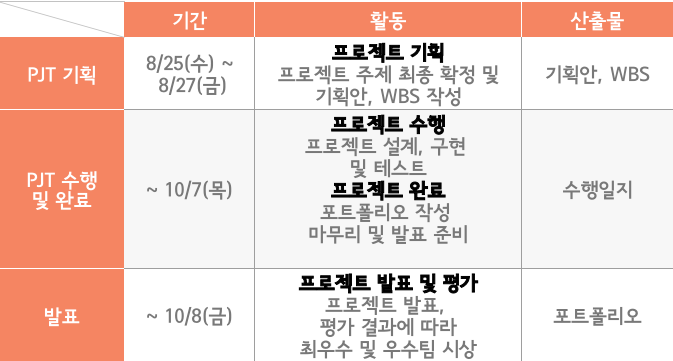
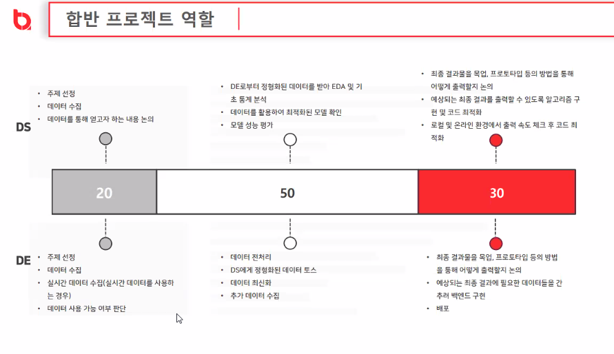

[DE]

1. 주제선정, 데이터 수집, 실시간 데이터 수집, 데이터 사용 가능 여부 판단
2. 데이터 전처리, DS에게 정형화 된 데이터 토스, 데이터 최신화, 추가 데이터 수집
3. 최종 결과물을 목업, 프로토타입 등의 방법을 통해 어떻게 출력할지 논의, 예상되는 최종 결과에 필요한 데이터들을 간추려 백엔드 구현, 배포

의료, 유통, 제조, 스포츠, 디자인, 문화

DS : 머신러닝 체계적인 복습

팀명

팀원별 역할

환경, KPOP, 건강

서비스

실시간 데이터 

와치4

응급처지, 음식물 쓰레기 배출

스팸 리뷰 분석, 하둡+스파크 다양한 플랫폼

추천엔진 (건강 식품)

영양제 : 수면패턴

건강보조제 추천

시각장애인

김정호 01043333467 junhk2005@naver.com

박형준 01099030311 

조민호 01027877994 minong0210@gamil.com

남예은 010-9256-9622 ye4466@gmail.com

헬스케어, 음식

주제1. 설문 기반 건강기능 식품 추천 시스템 개발

주제2. BMI등 사용자 정보와 음식 영양 정보 분석을 통한 기초 건강 관리 시스템 개발

빅데이터 맵(통합데이터지도)

https://bigdata.seoul.go.kr/cnts.do?r_id=P200

https://www.dailypop.kr/news/articleView.html?idxno=46061

http://swedu.konkuk.ac.kr/noticeView.do?siteId=SWEDU&boardSeq=399&menuSeq=2604&seq=78791

https://opendata.hira.or.kr/home.do

https://blog.linewalks.com/archives/6452

https://aihub.or.kr/aihub-data/healthcare/about

http://swedu.konkuk.ac.kr/noticeView.do?siteId=SWEDU&boardSeq=399&menuSeq=2604&seq=78791

https://kosis.kr/statisticsList/statisticsListIndex.do?parentId=F.1&vwcd=MT_ZTITLE&menuId=M_01_01&outLink=Y&entrType=#content-group

https://www.monews.co.kr/news/articleView.html?idxno=216643

https://www.data.go.kr/data/15050912/fileData.do

